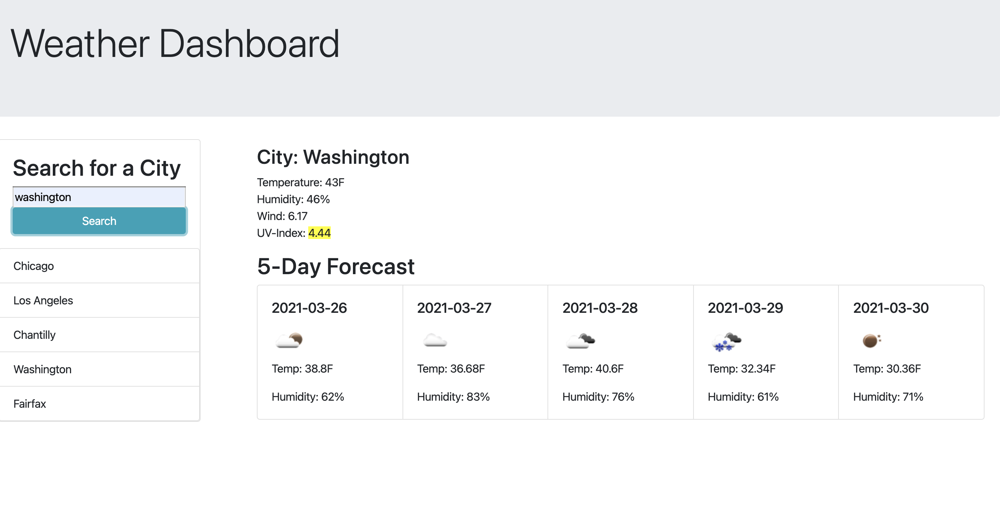

# weather-dashboard

## Description
This is weather dashboard application. User can search for a city and see the current weather for given city as well as 5 days forecast. There is a list of 5 last cities used. 
Current weather diplays temperature, humidity, wind, and uv index
Forecast data diplays date, a logo representing weather status, temperature and humidity.

### Link to application
https://dmitrybalduev.github.io/weather-dashboard/

### Screenshot

